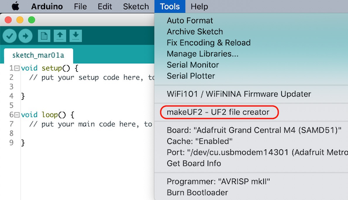

# Arduino UF2 file creator

Arduino plugin which creates a .uf2 file from a .bin file located in the sketch folder.
 
Tested with the following Arduino IDE versions:
1.8.8

## Installation
- Make sure you use one of the supported versions of Arduino IDE.
- Download the tool archive from [the releases page](https://github.com/blurfl/makeUF2-tool/releases).
- In your Arduino sketchbook directory, create tools directory if it doesn't exist yet.
- Unpack the tool into tools directory (the path will look like `<home_dir>/Arduino/tools/makeUF2/tool/makeUF2.jar)`.
- Restart Arduino IDE. 

On the OS X create the tools directory in ~/Documents/Arduino/ and unpack the files there

## Usage
- Open a sketch (or create a new one and save it).
- Make sure you have selected the proper board.
- Create a compiled binary image of the sketch: (choose *Sketch > Export compiled Binary*).
- Select the *Tools > makeUF2 - UF2 file creator* menu item. This will create a UF2 file from the compiled binary and place it in the sketch folder. Copy that file onto your xxxxBOOT disk to install it. 

## Screenshot

## Credits and license

   This work is based on:
   
       ESP8266FS.java,
       an Arduino plugin to put the contents of the sketch's "data" subfolder
       into an SPIFFS partition image and upload it to an ESP8266 MCU
       from the esp8266/arduino-esp8266fs-plugin repository 
       at 'https://github.com/esp8266/arduino-esp8266fs-plugin'
       Copyright (c) 2015 Hristo Gochkov (ficeto at ficeto dot com)
 
   and on:
   
       bin2uf2.js,
       from the adafruit/uf2-samdx1 branch of the Microsoft/uf2-samdx1 repository 
       at 'https://github.com/adafruit/uf2-samdx1'
   

## Issues and suggestions

File issues here on github
